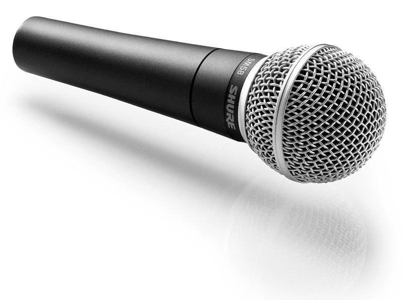

# 10 THINGS YOU NEED TO DO BEFORE YOU START RECORDING  

  As an aspiring musician, dreaming for years of becoming a succesful rockstar, you've probably already began messing around with recording. Before you begin, here are 10 important tips to get you going:

  1. **Have a good computer**  

  Mac, PC or Linux, get yourself a strong piece that will be able to carry the load and run your projects smoothly.

processor | What type of music can you make |entry level 
--- | :---: |---:
i3 | mostly simple beats,podcasting and projects with very little amount of tracks | beginner, cheap computer
i5| bigger projects with more tracks. Simple electronic music and pop songs| Intermediate, doesn't cost too much
i7/i9|heavy projects like cinematic, post production, complexed electronic| Advanced, costs quite plenty

2. Acoustics

Acousically treated room is a very important aspect before you start recording. The reverbration in your room can bounce back into your microphone while singing and cause problems. 

[Here is a nice video that explains all about acoustics](https://www.youtube.com/watch?v=JPYt10zrclQ)

3. Audio interface

This device is connecting your computer and replaces your soundcard *for something much better*. The quality of your audio interface is not as important as you may think, since most interfaces today have **great qualities**, but instead, the prices determine what type of connections you have, outputs and inner-system features.

Popluar interfaces to consider:
- [Focusrite Scarlet i2i](https://focusrite.com/en/scarlett)
- [Universal audio Arrow](https://www.woodbrass.com/de-de/audio-interfaces-thunderbolt-universal-audio-arrow-p257013.html)
- [Steinberg UR44](https://www.steinberg.net/en/products/audio_interfaces/ur_series/models/ur44.html)

4. Microphone

There are 3 main microphone types that are used in studios:  
A. [dynamics](https://www.neumann.com/homestudio/en/what-is-a-dynamic-microphone)
B. Ribbons

